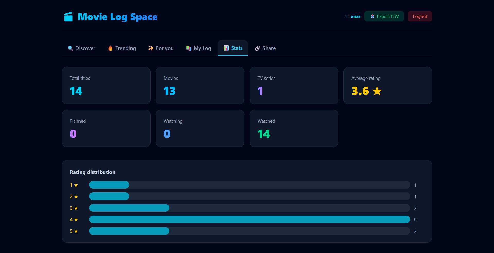
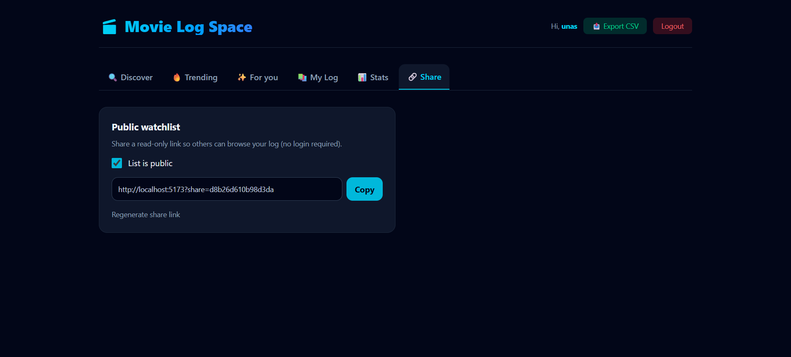

# Movie Log Space

Track, rate, and share movies & TV shows you watch.


## About

**Movie Log Space** is a full-stack web app where you can:

- Search and browse trending movies & TV shows (TMDB)
- Save titles to a personal log with ratings, status, tags, and notes
- See stats (movies vs series, average rating, watch status)
- Get recommendations based on your log
- Share a public watchlist link
- Export your log as CSV

## Screenshots





-->

## Tech Stack

| Layer | Tools |
|-------|--------|
| Frontend | React 19, Vite, Tailwind CSS, Axios |
| Backend | Node.js, Express 5, JWT, bcrypt |
| Database | MongoDB + Mongoose |
| API | [The Movie Database (TMDB)](https://www.themoviedb.org/) |

## Getting Started

### Requirements

- Node.js 20+
- MongoDB (local or [Atlas](https://www.mongodb.com/atlas))
- Free [TMDB API key](https://www.themoviedb.org/settings/api)

### 1. Clone

```bash
git clone https://github.com/YOUR_USERNAME/movie-app.git
cd movie-app
2. Backend setup
Bashcd backend
cp .env.example .env
npm install
Edit backend/.env:
envMONGO_URI=mongodb://127.0.0.1:27017/movieDB
JWT_SECRET=your_strong_secret_here
JWT_ACCESS_EXPIRES=60m
JWT_REFRESH_EXPIRES=7d
TMDB_API_KEY=your_tmdb_api_key
PORT=5000
FRONTEND_URL=http://localhost:5173
Start the API:
Bashnpm start
API: http://localhost:5000
Health: http://localhost:5000/api/health
3. Frontend setup
Bashcd frontend
cp .env.example .env
npm install
Edit frontend/.env:
envVITE_API_URL=http://localhost:5000/api
VITE_APP_URL=http://localhost:5173
Start the app:
Bashnpm run dev
Open: http://localhost:5173
Project Structure
textmovie-app/
├── backend/          # Express API
│   ├── controllers/
│   ├── models/
│   ├── routes/
│   ├── middleware/
│   └── server.js
└── frontend/         # React + Vite
    └── src/
        ├── components/
        ├── context/
        └── api.js
Environment Variables
Do not commit .env files. Only commit .env.example.
Backend
NameDescriptionMONGO_URIMongoDB connection stringJWT_SECRETSecret for JWT signingTMDB_API_KEYTMDB API keyPORTServer port (default 5000)FRONTEND_URLCORS allowed origin
Frontend
NameDescriptionVITE_API_URLBackend API base URLVITE_APP_URLPublic app URL (used for share links)
Features Walkthrough

Sign up / Log in — create an account and get JWT session
Discover / Trending — find titles and add them to your log
My Log — filter by status/tags, edit ratings and notes
Stats — totals for movies, TV series, and ratings
For you — similar titles from something you already logged
Share — copy a public link (?share=...) others can open without login

Share links use localhost in development. After you deploy, set VITE_APP_URL to your live domain.
Scripts
Bash# Backend
cd backend && npm start

# Frontend
cd frontend && npm run dev
cd frontend && npm run build
